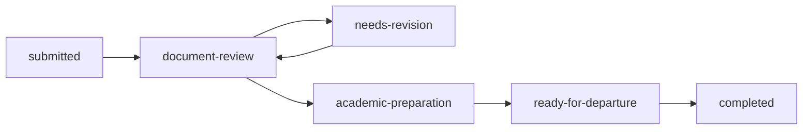

# Audit implementasi dan rencana menuju launch

Tanggal: 19 September 2026. Baseline: `main`, commit `2e16613`.
Dokumen ini mencatat kondisi yang ditemukan, bukan menyatakan semua rancangan sudah diimplementasikan. Audit ini tidak mengubah kode aplikasi atau data produksi.

## 1. Kesimpulan

Repo sudah memiliki frontend publik dan portal, API, penyimpanan PostgreSQL, kontrol akses, serta fondasi storage privat. Ini sudah melampaui prototipe visual. Namun, repo **belum layak diluncurkan sebagai keseluruhan produk**: ada test gagal, alur akun dan dokumen terputus, serta konversi pendaftar menjadi santri belum dibangun.

Jumlah tabel atau halaman tidak bisa dijadikan persentase selesai. Status yang tepat adalah: fondasi tersedia; sejumlah modul dasar berfungsi; integrasi menyeluruh dan kelengkapan produk masih perlu dikerjakan.

Rencana lama di `PANDUAN_BUILD.md` tetap menjadi referensi kebutuhan Phase 6–16. Temuan dalam dokumen ini mengoreksi klaim implementasi yang tidak didukung kode/test. Estimasi waktu lama perlu dihitung ulang setelah blocker diselesaikan dan cakupan rilis disepakati.

### Bukti verifikasi

| Pemeriksaan | Hasil | Batas interpretasi |
|---|---|---|
| `npm test` | Gagal: 35 dari 36 unit file test lulus | Ini hitungan file test, bukan 36 skenario bisnis |
| Matriks akses | Gagal karena `registrations.convert` belum tercakup | Endpoint konversi juga belum tersedia |
| `npm run verify:database` | 16 migrasi, 29 tabel aplikasi, seluruhnya RLS aktif | Tidak membuktikan backup, restore, atau semua alur produk aman |
| Probe reset bersamaan di memory service | Dua pemakaian token yang sama berhasil | Perlu regresi transaksi PostgreSQL; belum diuji dengan beban produksi |
| Probe sesi setelah reset | Sesi lama tetap valid | Reset belum mencabut sesi akun |
| Probe tanggal lahir | `2020-02-31` diterima | Validasi kalender perlu diperbaiki |
| Inspeksi kode frontend/CSP | Initializer inline halaman akun bertentangan dengan CSP | Uji browser menyeluruh masih diperlukan |

Belum diverifikasi dalam audit ini: klik seluruh UI di browser, pengiriman email nyata, upload nyata ke Supabase, restore backup, domain/HTTPS produksi, hasil GitHub Actions remote, performa berbeban, dan persetujuan UAT klien. Tidak ada email dikirim atau migrasi produksi dijalankan dalam audit ini.

## 2. Inventaris frontend

| Bagian | Implementasi tersedia | Kekurangan menuju siap pakai |
|---|---|---|
| Landing page `/website/` | `index.html`, `website.js`, `website.css`; informasi program, navigasi, formulir | Verifikasi seluruh klaim/konten, keadaan gagal/berhasil, dan konsistensi alur daftar baru |
| Artikel/kegiatan | `articles.html/js`, `article.html/js`; membaca API artikel | Siklus editorial, preview, cover, pengarsipan, SEO halaman individual |
| Biaya dan kontak | `biaya.html`, `kontak.html` | Persetujuan konten/nominal/kontak oleh Hamasah; jangan menganggap informasi statis selalu terbaru |
| Cek pendaftaran | `cek-status.html/js`; status, riwayat, referensi dokumen | Masih token lama dan input referensi teks, belum upload berkas end-to-end |
| Portal akun | `portal.html/js/css`; login, dashboard beberapa peran | Statistik/identitas contoh masih ada; hubungkan ke data sebenarnya dan invitation flow |
| Konsol petugas | `staff.html/js/css`; daftar pendaftar, status, pembuatan artikel | Review dokumen, catatan, tindak lanjut, konversi, pagination belum lengkap |
| Monitoring | `monitoring.html/js`; pencatatan kegiatan, kehadiran, prestasi, evaluasi, pelanggaran | Visibilitas keluarga/internal, deduplikasi, laporan longitudinal, galeri/izin media |
| Operasional | `operations.html/js`; invoice, visa, inventaris | Bukti pembayaran, verifikasi, koreksi transaksi, kuitansi dan laporan |
| LMS | `lms.html/js`; materi, enrollment, progress dan bantuan belajar dasar | Pemutar materi nyata, kuis/tugas/nilai, aturan kelulusan, AI nyata |
| Audit | `audit.html/js`; daftar dan filter kejadian | Uji akses, retensi, integrasi setiap tindakan kritis |
| Aktivasi/reset | `aktivasi.html`, `reset-password.html`, `lupa-password.html`, `auth-pages.js` | Skrip inline diblokir CSP; lifecycle token/sesi perlu diperbaiki |
| Proposal lama | Berkas root `index.html`, `app.js`, `styles.css` | Pisahkan status mockup dari produk; jangan menjadi bukti fitur selesai |

Portal gabungan sudah memuat sebagian kebutuhan lintas peran. Tidak adanya nama halaman khusus keluarga/akademik bukan bukti bahwa semua fungsinya tidak ada. Penilaian harus melalui tindakan yang bisa dilakukan pengguna.

## 3. Inventaris backend

Arsitektur: Node.js HTTP native, CommonJS, frontend vanilla, PostgreSQL melalui `pg`, dan PGlite untuk pengujian. `server/app.js` merangkai store, service, middleware otorisasi, route, dan pekerjaan pembersihan.

| Modul | Yang sudah dibangun | Batas saat ini |
|---|---|---|
| Identity | Akun, hash scrypt, login/logout, sesi, reset, undangan | Konsumsi token tidak atomik; reset tidak mencabut sesi; UI belum tersambung benar |
| Akses | Tujuh role, permission matrix, pembatasan kepemilikan dan asrama | Izin konversi mendahului endpoint; perlu uji per-resource untuk fitur baru |
| Pendaftaran | Create/read/status, profil v2, kode akses/sesi calon, dokumen, review/catatan | Dua mekanisme auth, validasi parsial, update snapshot rawan kehilangan perubahan |
| Storage | File metadata, validasi MIME/signature, upload, akses privat | Belum terikat secara benar ke dokumen pendaftaran; consent media belum ditegakkan |
| Santri | Profil, relasi wali, data monitoring, lingkup pengawas | Belum ada transaksi konversi pendaftar; aturan visibilitas belum rinci |
| LMS | Course, materi, enrollment, penyelesaian, progress | Belum assessment; bantuan keyword bukan generative AI |
| Operasional | Invoice/nomor dokumen, mark-paid, visa, inventaris, asrama | Belum siklus pembayaran/receipt/laporan lengkap |
| Artikel/FAQ | Artikel read/create; FAQ keyword | Belum CMS lengkap dan sumber pengetahuan AI terkelola |
| Notifikasi | Adapter email dan pencatatan outbox | Pengiriman masih sinkron; belum worker durable/retry/recovery |
| Infrastruktur | Health endpoint, security headers, rate limiting, audit, Docker, workflow test | Belum bukti kesiapan deployment, restore, observability, dan UAT |

Role tersedia: `admin`, `registration-officer`, `parent`, `student`, `supervisor`, `teacher`, `finance`.

## 4. Inventaris database

| Domain | Tabel aplikasi yang tersedia |
|---|---|
| Akun | `accounts`, `account_sessions` |
| Pendaftaran | `registrations`, `registration_status_events`, `registration_documents`, `applicant_sessions`, `registration_notes`, `registration_next_steps` |
| Publik | `articles` |
| Santri/keluarga | `students`, `student_parent_accounts`, `student_activities`, `student_attendance`, `student_achievements`, `student_evaluations`, `student_violations` |
| Akademik | `courses`, `course_materials`, `course_enrollments`, `course_completions` |
| Operasional | `invoices`, `visa_tracking`, `inventory_items`, `document_counters`, `dormitories`, `staff_dormitory_assignments` |
| Pendukung | `audit_events`, `file_objects`, `notification_outbox` |

Total 29 tabel aplikasi; ledger `schema_migrations` merupakan tabel infrastruktur tambahan.

Migrasi 001–011 membangun schema awal, sesi, RLS, nomor dokumen, relasi actor, urutan materi, role, asrama, audit, aktivitas sesi, dan metadata file. Migrasi 012–016 menambah undangan/notifikasi, profil pendaftar, kode akses, review/tindak lanjut, serta relasi unik santri ke pendaftaran.

RLS aktif bukan pengganti otorisasi backend. Kebijakan saat ini membatasi akses langsung melalui Data API; koneksi backend berprivilege tetap harus menjalankan pemeriksaan role, kepemilikan, dan asrama.

Schema lanjutan ditentukan oleh kebutuhan, antara lain pembayaran/bukti/kuitansi, konten dan FAQ terkelola, laporan/media, assessment LMS, serta penggunaan AI. Jangan menambah tabel hanya untuk memenuhi jumlah. Tambahkan constraint/index/migrasi dan test untuk setiap aturan bisnis yang dipilih.

## 5. Temuan dan prioritas

P1: menghalangi rilis fitur terkait atau berisiko pada akses/integritas data. P2: fungsi belum lengkap atau risiko operasional yang harus selesai sebelum fitur dipasarkan. P3: pemeliharaan.

| ID | Prioritas | Temuan, bukti, dan dampak | Perbaikan wajib |
|---|---|---|---|
| A01 | P1 | `server/access-matrix.test.js:235` gagal; `server/access-policy.js:28` memuat `registrations.convert`, tetapi route konversi tidak ada | Implementasi transaksi/endpoint dan test akses; jangan menghapus assertion untuk menghijaukan test |
| A02 | P1 | `server/http/security-headers.js:10` membatasi script ke self; aktivasi/reset/lupa memakai initializer inline | Pindahkan initializer ke JS eksternal dan CSS inline ke stylesheet; pertahankan CSP ketat, uji submit di browser |
| A03 | P1 | `server/identity-service.js:384` dan `:402` membaca token lalu menyimpan akun; probe reset ganda berhasil dan sesi lama hidup | Konsumsi token bersyarat dan update password atomik; revoke sesi; test token paralel/expired/deactivated |
| A04 | P1 | `website/cek-status.js` meminta storage key; `website/registration-service.js` menerima referensi tanpa memastikan file ready/milik pendaftar | Upload isi berkas melalui storage, link `fileObjectId` tervalidasi, tolak file asing/pending/tidak ada |
| A05 | P1 | `server/http/auth.js:71` masih mengenali token lama; API applicant baru memakai sesi berbeda; UI menggunakan jalur lama | Satukan auth calon pada semua endpoint, logout/recovery/expiry, transisi token lama berbatas waktu; hilangkan token dari URL |
| A06 | P1 | `server/postgres-registration-store.js:278`–`:279` menghapus dan membangun ulang dokumen/riwayat dari snapshot | Update terarah atau version/row locking; histori append-only; test review+status+upload bersamaan |
| A07 | P1 | Data dinamis masuk `innerHTML`: catatan `website/cek-status.js:105`, poin LMS `website/lms.js:245`, template portal | Pakai DOM/textContent atau sanitizer terbatas; test payload HTML. Ini sink injeksi terkonfirmasi, bukan bukti exploit browser yang sudah dijalankan |
| A08 | P1 | Portal menampilkan angka progress/target dan identitas contoh (`website/portal.js` sekitar 1382–1470) | Data API nyata atau empty state; jangan tampilkan pencapaian buatan sebagai milik pengguna |
| A09 | P2 | `server/notification-service.js` mencatat lalu mengirim sinkron, belum durable worker | Persist pekerjaan yang dapat dikirim ulang, claim atomik, idempotency, timeout, retry/backoff, recovery dan status yang jujur |
| A10 | P2 | Validasi profil v2 opsional menurut field; tanggal tak nyata diterima; timestamp persetujuan dapat mengikuti update status | Wajibkan kontrak v2 untuk write baru, validasi kalender/umur/timezone, pertahankan waktu dan versi consent |
| A11 | P2 | Store next-step ada, alur service/route/UI belum lengkap; petugas belum memiliki workspace review menyeluruh | CRUD terbatas untuk tindak lanjut, alasan revisi/batal, filter catatan internal, completion yang terlacak |
| A12 | P2 | List registrasi memuat semua record beserta query relasi per record | Pagination/filter server, query batch, index dan pengujian dataset realistis |
| A13 | P2 | Evaluasi/pelanggaran dikembalikan tanpa kategori visibilitas internal/keluarga; consent media belum menjadi gate upload | DTO per role, visibility field, enforce consent, deduplikasi kehadiran harian sesuai aturan |
| A14 | P2 | LMS mengizinkan tipe quiz/assignment tetapi belum attempt/submission/scoring; complete masih manual | Implementasi assessment dan aturan progress; jangan beri kelulusan kuis hanya karena klik selesai |
| A15 | P2 | FAQ/study help berbasis keyword/studyGuide | Nyatakan kemampuan sebenarnya; bangun provider AI, retrieval, batas biaya, evaluasi dan fallback sebelum dilabeli AI |
| A16 | P2 | Invoice baru mark-paid dan nomor receipt; belum bukti pembayaran/verifikasi/koreksi | Lifecycle pembayaran, bukti privat, audit, receipt final, otorisasi finance dan test idempotensi |
| A17 | P2 | Artikel belum workflow draft/edit/archive; kebutuhan metadata/sitemap konten dinamis belum lengkap | CMS dan SEO sesuai halaman yang benar-benar diterbitkan |
| A18 | P2 | `.env.example` belum mencakup seluruh konfigurasi storage/produksi; restore, monitoring, dan staging belum terbukti | Sinkronkan env/runbook, validasi startup, latihan restore dan rollback, observability |
| A19 | P2 | Renew invitation dapat mencakup akun inactive tanpa membedakan pending invitation dan dinonaktifkan | Pisahkan lifecycle, cegah undangan mengaktifkan kembali akun disabled tanpa tindakan admin yang sah |
| A20 | P3 | Timer cleanup upload tidak seluruhnya ditutup bersama aplikasi; alias proposal belum seluruhnya masuk Docker | Tutup timer pada shutdown; tetapkan apakah proposal memang bagian deployment dan test packaging |

Untuk A03, pola baca-hash-save yang sama digunakan service dengan store SQL; eksploit konkurensi PostgreSQL perlu test tersendiri. Untuk A07, CSP mengurangi sebagian vektor, tetapi tidak menggantikan encoding data dan tidak mencegah seluruh injeksi markup.

## 6. Logika dan flow saat ini

### Pendaftaran

1. Calon mengirim formulir publik ke API pendaftaran.
2. Backend membuat registrasi dan mengembalikan token lama serta kode akses baru.
3. Frontend masih menggunakan token lama untuk cek status dan referensi dokumen. Kode baru belum menjadi jalur utama UI.
4. Petugas mengubah status melalui konsol.
5. Catatan/review sudah memiliki bagian backend, tetapi belum seluruhnya bisa dikerjakan dari UI.
6. Status selesai tidak otomatis membuat profil santri, akun santri, atau akun wali.

Alur status yang ada:

Status aktif juga memiliki jalur pembatalan sesuai aturan domain. Transisi harus ditegakkan di server, bukan hanya pilihan dropdown UI.

### Dokumen

Storage mempunyai alur metadata pending → upload bytes dan validasi → ready → download terotorisasi. Namun, pendaftaran masih dapat menerima storage key sebagai teks. Akibatnya, adanya baris dokumen belum membuktikan berkas benar-benar diunggah dan dimiliki calon yang benar.

### Akun

Undangan membuat akun inactive dan hash token → email sinkron → halaman aktivasi → set password/active. Initializer halaman bermasalah dengan CSP. Reset memiliki token kedaluwarsa, tetapi penggunaan bersamaan dan pencabutan sesi belum aman. Akun manual dengan password masih tersedia sebagai jalur lain.

### Santri dan keluarga

Profil santri dibuat langsung → akun/relasi wali dihubungkan → kegiatan/kehadiran/prestasi/evaluasi/pelanggaran dicatat → dashboard dibaca sesuai relasi. Pengawas memiliki pembatasan asrama. Pembatasan antar-keluarga sudah ada; pemisahan catatan internal dan informasi yang layak terlihat keluarga masih perlu aturan eksplisit.

### LMS dan bantuan belajar

Course dibuat → materi diurutkan → santri di-enroll → materi dibuka → completion dicatat → persentase dihitung. Bantuan belajar mengambil panduan/keyword yang tersedia. Belum ada proses kuis/tugas bernilai atau partner belajar berbasis model AI.

### Operasional

Invoice dibuat → finance/staf berizin menandai paid → nomor receipt disimpan. Visa dan inventaris memiliki pencatatan dasar. Ini belum sama dengan proses bukti bayar, verifikasi, koreksi dan laporan keuangan lengkap.

## 7. Flow target yang harus diselesaikan

### Pendaftaran sampai aktif sebagai santri

1. Pilih program, baca persyaratan dan biaya yang disetujui Hamasah.
2. Isi profil valid, identitas wali sesuai kebijakan, dan consent yang tercatat waktu/versinya.
3. Terima nomor pendaftaran serta instruksi akses; tampilkan kode sensitif hanya pada tempat yang aman.
4. Login calon; semua endpoint calon memakai satu mekanisme sesi dengan expiry/logout/recovery.
5. Upload file privat; dokumen terhubung ke file ready dengan kepemilikan dan purpose yang benar.
6. Petugas review; calon hanya melihat catatan untuknya, alasan revisi, dan langkah berikutnya.
7. Revisi menghasilkan rekam jejak yang stabil; update bersamaan tidak saling menghapus.
8. Ketika memenuhi syarat bisnis, petugas menjalankan konversi idempotent.
9. Dalam satu transaksi: kunci registrasi, validasi status/data/asrama, buat santri, akun dan relasi wali, audit, serta pekerjaan undangan.
10. Commit dahulu, baru worker mengirim email. Kegagalan email tidak membatalkan profil yang sudah sah; pekerjaan dapat diulang tanpa membuat akun ganda.
11. Santri/wali mengaktifkan akun dan langsung melihat data miliknya.

Aturan konversi yang harus ditetapkan sebelum implementasi: status minimum; field wajib per program; akun wali yang sudah ada bisa dipakai untuk saudara; konflik email lintas role ditolak; email santri tidak boleh dipakai untuk identitas lain; kapasitas/jenis asrama valid; konversi kedua mengembalikan hasil yang sama. Error di tengah transaksi harus rollback seluruh perubahan.

### Monitoring keluarga

Pengawas mencatat data dalam lingkupnya → validasi tanggal/duplikat/visibility → audit → wali membaca anak yang terhubung → grafik/ringkasan dihitung dari data nyata. Koreksi tercatat. Publikasi foto/video mengikuti consent dan akses privat. Laporan sejak masuk sampai lulus mempunyai definisi periode, status, dan sumber data yang konsisten.

### Belajar

Enrollment sah → materi yang boleh diakses → aktivitas belajar → tugas/kuis bila diwajibkan → hasil dinilai → progress/kelulusan menurut aturan → achievement/sertifikat bila masuk cakupan. AI membaca materi yang boleh diakses santri, menyebut sumber, mengakui informasi yang tidak tersedia, dan tidak membocorkan data santri lain.

### Pembayaran

Invoice sah → bukti bayar privat → finance verifikasi → transaksi atomik/idempotent → status dan kuitansi final → wali melihat miliknya. Koreksi atau pembatalan menghasilkan riwayat, bukan menghapus jejak pembayaran.

## 8. Rencana kerja berurutan

Setiap task mencakup schema bila diperlukan, service, API, UI, test, dan dokumentasi. Jangan menutup task hanya karena endpoint berhasil lewat curl. Penomoran di bawah merupakan urutan eksekusi audit, bukan mengganti penomoran phase lama.

### Tahap 0 — Stabilkan fondasi (koreksi Phase 6–8)

- [ ] T00.1 Buat baseline test yang dapat direproduksi dan simpan temuan gagal A01. Jangan menghapus izin/test tanpa menuntaskan kebutuhan konversi.
- [ ] T00.2 Perbaiki CSP/initializer halaman akun; pastikan aktivasi, lupa, reset dapat disubmit dari browser.
- [ ] T00.3 Konsumsi token atomik, revoke sesi reset, lindungi lifecycle disabled/pending dan test konkurensi SQL.
- [ ] T00.4 Audit semua sink HTML dinamis dan validasi server; tambahkan regresi input berbahaya.
- [ ] T00.5 Hilangkan metrik/identitas contoh dari dashboard produksi.

Gate: regresi keamanan lulus, alur akun berfungsi di browser; kegagalan matriks konversi tetap dilacak sampai Tahap 3 selesai. Tidak boleh rilis dengan suite masih merah.

### Tahap 1 — Notifikasi yang dapat diandalkan (Phase 8)

Dependensi: T00.3.

- [ ] T01.1 Outbox transaksional berisi pekerjaan yang benar-benar dapat dikirim, claim/lock, retry/backoff dan idempotency.
- [ ] T01.2 Timeout provider, status accepted/failed yang tepat, recovery sesudah proses mati; jangan samakan diterima provider dengan diterima pengguna.
- [ ] T01.3 Lindungi material token dalam pekerjaan menggunakan rancangan penyimpanan aman dengan TTL dan akses terbatas; jangan menulis token ke log.
- [ ] T01.4 UI invitation/resend/error yang memakai lifecycle baru; dev test menggunakan adapter aman.
- [ ] T01.5 Dokumentasikan env email yang ditunda user; verifikasi provider nyata hanya saat env tersedia.

Gate: crash/retry tidak menggandakan undangan atau kehilangan pekerjaan; test adapter lulus. Integrasi email nyata tetap menjadi gate sebelum fitur akun diluncurkan.

### Tahap 2 — Pendaftaran lengkap (Phase 9)

Dependensi: Tahap 0; notifikasi memakai Tahap 1.

- [x] T02.1 Kontrak profil per program, validasi tanggal nyata/umur dan consent; kompatibilitas legacy hanya untuk membaca/migrasi.
- [x] T02.2 Satu auth calon, login/logout/expiry/recovery; hapus kredensial pada URL dan tentukan masa transisi.
- [x] T02.3 UI file picker/progress/error, upload bytes, link file terotorisasi, download, revisi dan penghapusan sesuai retensi.
- [x] T02.4 Update registrasi terarah dan histori stabil, constraint/locking, test perubahan bersamaan.
- [x] T02.5 Workspace petugas: pencarian/pagination, review dokumen, catatan internal/publik, next steps dan alasan status.
- [x] T02.6 UI calon: edit yang diizinkan, revisi dokumen, status, catatan yang relevan dan tindak lanjut.

Gate: orang baru dapat mendaftar sampai lolos review tanpa edit database/manual API; berkas keluarga lain selalu ditolak; perubahan paralel tidak hilang.

### Tahap 3 — Konversi pendaftar menjadi santri (sambungan Phase 9–11)

Dependensi: Tahap 1–2.

- [x] T03.1 Putuskan aturan kelayakan dan mapping profil/akun/wali/asrama, termasuk existing parent dan konflik email.
- [x] T03.2 Implementasi service + transaksi SQL dengan unique constraint dan row lock.
- [x] T03.3 Endpoint `registrations.convert`, permission matrix, audit dan outbox dalam transaksi yang sama.
- [x] T03.4 Tombol/konfirmasi hasil konversi di petugas; tampilkan existing result untuk retry.
- [x] T03.5 Test double-click, dua petugas bersamaan, rollback di setiap kegagalan, parent untuk saudara, konflik role dan akses ilegal.

Gate: pertama membuat satu santri; retry tidak menggandakan; seluruh `npm test` hijau termasuk matriks akses. Undangan bisa diproses sesudah commit.

### Tahap 4 — Rilis A: publik, artikel, pendaftaran (Phase 9)

- [ ] T04.1 Audit konten asli Hamasah bersama pemilik; program, biaya, syarat, kontak dan jadwal mempunyai penanggung jawab.
- [ ] T04.2 CMS draft/edit/publish/archive dan cover/media berizin; artikel kegiatan dapat dikelola staf.
- [x] T04.3 Lengkapi FAQ yang jujur, metadata halaman, sitemap, 404, tautan dan navigasi.
- [ ] T04.4 Review mobile/keyboard/form error/loading/empty/success; pertahankan identitas logo dan tipografi yang sudah dipilih.
- [ ] T04.5 Lengkapi pemberitahuan privasi/consent/retensi dengan pihak berwenang di Hamasah.
- [ ] T04.6 Jalankan gate deployment pada Bagian 10 sebelum membuka Rilis A.

Gate: publik → daftar → dokumen → review → akun teruji. Fitur di luar Rilis A tidak ditampilkan seolah sudah tersedia. Rilis A bukan akhir seluruh proyek.

### Tahap 5 — Operasional dan keuangan (Phase 10)

- [ ] T05.1 Invoice/payment/proof/verification/receipt, status transisi dan koreksi yang diaudit.
- [ ] T05.2 PDF/nomor verifikasi kuitansi sesuai kebutuhan yang disetujui; test nomor unik dan pembayaran paralel.
- [ ] T05.3 Asrama: kapasitas, penempatan, pengawas, perpindahan dan lingkup akses.
- [ ] T05.4 Visa: dokumen, riwayat status, tenggat dan pengingat sesuai alur nyata.
- [ ] T05.5 Inventaris: mutasi masuk/keluar/koreksi dan larangan stok tidak valid.
- [ ] T05.6 Import data bila diperlukan: preview, validasi, deteksi duplikat, rollback dan audit; laporan/filter/pagination.

Gate: finance tidak bisa mengambil data di luar wewenang; bukti/kuitansi keluarga terisolasi; pembatalan dan retry tidak merusak saldo/status.

### Tahap 6 — Rilis B: keluarga dan rekam jejak (Phase 11)

- [ ] T06.1 Definisikan visibility per catatan; DTO wali/santri/staf, izin media dan retensi.
- [ ] T06.2 Kehadiran unik menurut sesi/hari, kegiatan, prestasi, pelanggaran dan evaluasi dengan koreksi berjejak.
- [ ] T06.3 Dashboard riil lintas periode; sibling selector; laporan sejak bergabung sampai lulus.
- [ ] T06.4 Galeri, laporan unduh dan komunikasi keluarga jika masuk kontrak; scope dan otorisasi eksplisit.
- [ ] T06.5 UAT pengawas dan wali dengan data simulasi realistis, termasuk anak pindah asrama dan wali beberapa anak.

Gate: dua keluarga tidak bisa saling melihat data; pengawas dibatasi penugasan; seluruh ringkasan cocok dengan catatan sumber. Terapkan gate deployment kembali untuk Rilis B.

### Tahap 7 — Akademik/LMS (Phase 12)

- [ ] T07.1 Kelola course/materi/publikasi/enrollment dan hak guru atas course.
- [ ] T07.2 Media materi nyata dan akses provider sesuai keputusan privasi/biaya, bukan pemutar dekoratif.
- [ ] T07.3 Tugas, submission, kuis, attempt, scoring/review, batas percobaan dan versi materi.
- [ ] T07.4 Aturan completion/progress/kelulusan dan sertifikat bila masuk scope; hitung server-side.
- [ ] T07.5 Uji santri tanpa enrollment, completion berulang, perubahan urutan, materi dihapus/diarsip, hasil nilai dan isolasi course.

Gate: satu pembelajaran lengkap dari enrollment sampai nilai/kelulusan dapat dilakukan lewat UI dan hasilnya benar.

### Tahap 8 — Rilis C: AI (Phase 13)

- [ ] T08.1 Pilih provider/model yang benar-benar tersedia saat implementasi, biaya dan aturan data; jangan memakai nama/model/harga lama tanpa verifikasi.
- [ ] T08.2 FAQ publik memakai sumber yang disetujui dan rujukan/handoff petugas untuk ketidakpastian.
- [ ] T08.3 Ringkasan/tanya jawab/partner belajar berdasarkan materi yang boleh diakses akun.
- [ ] T08.4 Rate limit, quota/anggaran, timeout, cache sesuai privasi, pemantauan dan fallback.
- [ ] T08.5 Dataset evaluasi pertanyaan nyata: jawaban benar, sumber, penolakan akses, prompt injection, materi tidak ada, provider gagal.

Gate: evaluasi mutu disetujui pengajar; tidak ada akses lintas akun/materi; kegagalan AI tidak menghalangi belajar. Terapkan gate deployment untuk Rilis C.

### Tahap 9 — Penutupan dan serah terima (Phase 14–15)

- [ ] T09.1 Regression seluruh role dan flow utama, aksesibilitas, responsive, performa, dependency/security review.
- [ ] T09.2 Runbook deployment, backup/restore, rollback, incident response, monitoring, retensi dan rotasi akses.
- [ ] T09.3 Latihan restore ke lingkungan terpisah; verifikasi data, file, akses dan konsistensi setelah restore.
- [ ] T09.4 UAT ditandatangani pemilik proses; panduan admin/petugas/guru/pengawas/wali/santri dan pelatihan.
- [ ] T09.5 Catat versi rilis, known limitations yang diterima, pemilik operasional dan periode dukungan.

Phase 16 (WhatsApp/payment gateway) tetap opsional sesuai kontrak. Jangan menjadikannya blocker untuk produk yang tidak menawarkan integrasi tersebut.

## 9. Matriks pengujian wajib

| Area | Skenario positif | Skenario negatif/konkurensi | Bukti lulus |
|---|---|---|---|
| Akun | Invite, activate, login, logout, reset | Expired/reused token, dua reset, disabled account, sesi lama | Unit + SQL integration + browser |
| Role/resource | Setiap role melakukan tugasnya | Role salah, ID keluarga lain, asrama lain, file lain | Access matrix dan endpoint tests |
| Registrasi | Form → status → revisi → lolos | Tanggal invalid, field hilang, consent berubah, update simultan | Validation + integration + browser |
| File | Upload/download file valid | MIME palsu, oversized, pending, orphan, foreign owner | Storage tests + staging provider |
| Konversi | Profil+akun+wali+undangan | Double-click, race, email conflict, rollback | SQL transactional tests |
| Notifikasi | Job diproses | Crash sebelum/sesudah send, timeout, provider 5xx, retry | Worker integration dan staging email |
| Monitoring | Rekam dan ringkas periode | Kehadiran duplikat, catatan internal, consent media | Per-role tests + UAT |
| Keuangan | Invoice → verifikasi → receipt | Double payment, jumlah invalid, bukti asing, correction | Transaction + browser tests |
| LMS | Enrollment → materi → hasil | Tanpa akses, completion palsu, retry, nilai invalid | Domain + API + browser |
| AI | Jawaban berbasis materi | Bocor data, prompt injection, biaya berlebih, provider mati | Eval dataset + budget tests |
| Publik | Navigasi, artikel, daftar | 404, jaringan gagal, keyboard, mobile sempit | Browser report dan screenshot |
| Operasional | Deploy dan health | DB/storage down, restore, rollback, restart worker | Runbook rehearsal |

Sasaran performa disepakati berdasarkan perkiraan pengguna/volume data. Rekam dataset, concurrency, latency persentil dan error rate; jangan mengklaim cepat dari satu request lokal. Semua pengujian mutasi menggunakan database test/staging, bukan data produksi.

## 10. Gate rilis dan pekerjaan manual

Sebelum **setiap** rilis A/B/C:

- [ ] Tidak ada P1 terbuka pada fungsi yang diterbitkan; tidak ada fitur belum jadi yang dipasarkan sebagai tersedia.
- [ ] `npm test` hijau, build/container check lulus, browser end-to-end dan negative authorization lulus.
- [ ] Migrasi diuji di staging dari versi sebelumnya dan pada database baru; backup sebelum produksi tersedia dan restore pernah dibuktikan.
- [ ] Env lengkap tervalidasi; rahasia tidak ada di commit/log; akses bootstrap ditutup setelah setup.
- [ ] Domain, HTTPS, APP_BASE_URL, email link, storage privat dan session policy diuji pada URL deployment sebenarnya.
- [ ] Monitoring error/health, alert, pemilik respons insiden dan rollback siap.
- [ ] Konten/biaya/kebijakan mendapat persetujuan Hamasah; UAT flow rilis diterima.

Pekerjaan manual user/pemilik layanan, dikerjakan ketika tahapnya membutuhkan:

1. **Email — ditunda sesuai instruksi user.** Tentukan domain pengirim dan provider; buat credential terbatas; pasang record DNS yang diberikan provider; tunggu verifikasi; isi env privat di deployment; lakukan pengiriman uji aktivasi/reset dan cek link/expired/retry. Jangan kirim credential lewat chat atau masukkan ke Git.
2. **Storage.** Pastikan bucket `hamasah-private-documents` privat; pasang konfigurasi server melalui secret manager/env; uji upload dan download sebagai dua pengguna berbeda. Bucket tersedia saja belum membuktikan flow berfungsi.
3. **Database.** Siapkan lingkungan staging terpisah, kebijakan backup dan akses terbatas; lakukan restore uji; baru terapkan migrasi produksi mengikuti runbook. Audit ini tidak memverifikasi backup lama.
4. **Akses/rahasia.** Pastikan credential yang pernah dibagikan di chat sudah diganti; perbarui env privat; cabut akses lama. Jangan tampilkan nilainya dalam laporan.
5. **Konten dan bisnis.** Hamasah mengesahkan syarat pendaftaran, status minimum konversi, biaya, aturan pembayaran, visibilitas catatan keluarga, consent media, dan retensi.
6. **AI/media.** Sebelum Tahap 7–8, pilih provider media/AI, anggaran dan aturan penggunaan data. Nama provider/model dalam rencana lama bukan keputusan implementasi final.
7. **Launch.** Pemilik domain mengatur DNS sesuai hosting; tim menjalankan smoke/UAT pada domain akhir; penanggung jawab menyetujui pembukaan akses publik.

Developer bertanggung jawab menyiapkan implementasi, validasi env, panduan langkah konkret sesuai provider yang dipilih, dan bukti uji. User hanya perlu mengerjakan tindakan yang memerlukan akun/otoritasnya. Pekerjaan kode yang tidak bergantung env harus tetap dapat dilanjutkan dengan adapter test.

Daftar gabungan yang harus dikerjakan manual dan diputuskan pemilik ada di `docs/LAUNCH_MANUAL_DAN_KEPUTUSAN_2026-09-20.md`.

## 11. Perbaikan proses pengerjaan

1. Gunakan satu task dengan acceptance criteria yang jelas. Perubahan selesai berarti DB/service/API/UI yang dibutuhkan sudah tersambung dan diuji.
2. Gunakan branch `codex/<topik>` dan perubahan yang mudah ditinjau; hindari mencampur desain besar, migrasi, dan keamanan dalam satu commit tanpa alasan.
3. Catat status: belum, sedang, terhalang, teruji, diterima. Jangan menulis selesai hanya karena file/migrasi sudah dibuat.
4. Setiap penutupan task menyebut perubahan, bukti test, batas verifikasi, manual action yang tertunda, dan task berikutnya.
5. Pertahankan blocker yang nyata di test; jangan mengubah test agar cacat terlihat lulus.
6. Schema baru harus punya pengguna di service/API/UI atau dinyatakan sebagai fondasi belum terintegrasi.
7. Update `IMPLEMENTATION_STATUS.md` berdasarkan audit dan hasil test setelah perbaikan, bukan menyalin klaim progres lama.
8. Jangan menjalankan migrasi produksi sebagai pengganti pengujian staging. Keberhasilan SQL bukan bukti alur produk selesai.

**Pekerjaan berikutnya:** UAT lokal sudah lulus. Pekerjaan berikutnya adalah menyelesaikan gap produk yang masih parsial, lalu menjalankan gate staging dan production secara terpisah.

## 12. Log eksekusi checkpoint

Checkpoint lokal branch `codex/phase-0-stabilization`.

- [x] T00.1 Baseline test dicatat tanpa menghapus assertion `registrations.convert`.
- [x] T00.2 Initializer inline aktivasi/reset/lupa dipindahkan ke `auth-pages.js`; test CSP/static terarah lulus.
- [x] T00.3 Reset dan undangan memakai konsumsi token bersyarat di memory/PostgreSQL store; reset mencabut sesi; test token bersamaan lulus di memory service.
- [x] T00.4 Sink utama catatan status, poin materi, deskripsi course, dan kartu aktivitas memakai escaping; regresi sintaks/test terarah lulus.
- [~] T00.5 Statistik dashboard yang sebelumnya mengklaim progress nyata diubah menjadi empty state. Kartu aktivitas contoh lain masih menunggu penggantian dengan data API pada Tahap 6/7.

Bukti checkpoint historis: `node --test server/identity-service.test.js website/registration-domain.test.js server/http/security-headers.test.js` lulus. Temuan A01 pada baseline sudah ditutup pada Tahap 3; validasi terbaru `npm test` menghasilkan 39/39 file lulus.

Tahap 1 berjalan sebagian: sender email sekarang memiliki timeout yang dapat diuji dan tidak menggantung proses. Outbox durable worker, claim/retry lintas restart, dan payload terenkripsi belum ditutup; fitur itu tetap menjadi pekerjaan Tahap 1 berikutnya.

Tahap 2 checkpoint berjalan sebagian:

- [x] Endpoint kandidat lama mengenali applicant session baru sebelum fallback token lama.
- [x] Form dokumen publik mengunggah bytes melalui `/api/uploads`, lalu menautkan `fileObjectId`.
- [x] Registration service menolak storage key manual, file asing, file pending, purpose/entity yang salah.
- [x] Test app menguji upload PDF nyata sampai dokumen tertaut; test service menguji referensi palsu.
- [x] Login UI cek pendaftaran memakai registration ID + access code dan endpoint applicant session; logout applicant juga tersedia.
- [x] Applicant session punya logout dan pembersihan kedaluwarsa; timer upload stale juga sekarang ditutup saat shutdown.
- [x] Update registration mengunci row induk dan tidak lagi menghapus child rows; review dokumen/history dipertahankan melalui insert/upsert terarah.
- [x] Recovery calon tersedia lewat endpoint generik `POST /api/applicant/recovery`, rate limit 3/jam, pencocokan email case-insensitive, hash kode baru, dan notifikasi tanpa membocorkan apakah data cocok.
- [x] Optimistic version parent snapshot dan stress test dua update SQL sudah dibuktikan oleh regression test PostgreSQL; tepat satu dari dua update snapshot yang sama berhasil.

Regression Tahap 3: 36 dari 36 file test lulus. A01 sudah ditutup dengan route konversi, transaksi idempotent, dan skenario matriks akses.

## 13. Log eksekusi Tahap 3

- [x] Migrasi 017 menambahkan `registrations.row_version` untuk optimistic concurrency.
- [x] Migrasi 018 menautkan notification outbox ke akun yang diundang.
- [x] Migrasi 019 menambahkan payload undangan terenkripsi (ciphertext/nonce/tag); token mentah tidak masuk database.
- [x] `registration-conversion-service` mengunci registrasi, memvalidasi status/email/role, membuat akun santri dan wali, membuat relasi, serta menulis outbox dalam satu transaksi.
- [x] Endpoint `POST /api/registrations/:id/convert` tersedia untuk admin dan registration officer.
- [x] Retry setelah konversi mengembalikan hasil idempotent tanpa membuat santri/akun ganda.
- [x] Matriks akses mencakup izin `registrations.convert` dan seluruh route berizin.
- [x] Full `npm test`: 37/37 file test lulus.
- [x] Migrasi 020 menambah lease claim, status `processing`, jadwal retry, dan recovery item yang ditinggal proses mati.
- [x] `notification-worker` mendekripsi undangan, membangun link aktivasi, memakai timeout provider, dan melakukan exponential backoff melalui store durable.
- [x] Worker diekspos sebagai `app.notificationWorker` agar dapat dijalankan oleh scheduler/worker process terpisah.
- [x] Entrypoint `npm run worker:notifications` tersedia untuk mode daemon atau `--once`, dengan graceful shutdown.
- [x] Konsol petugas menampilkan aksi konversi pada status siap keberangkatan/selesai, meminta konfirmasi, dan menampilkan hasil retry idempotent.
- [x] Halaman aktivasi menerima token hash, menolak token kosong, mengubah kata sandi sekali pakai, menampilkan akun aktif, lalu mengarahkan pengguna ke portal dengan pesan onboarding.
- [x] Workspace petugas memiliki review dokumen (terima/tolak dengan alasan) dan catatan internal/untuk pendaftar yang tersambung ke endpoint audit.
- [x] UI cek status menampilkan alasan penolakan dan memandu unggah ulang dokumen dengan jenis yang sama; integration test membuktikan reject → reupload → link berkas baru tanpa menghapus histori.
- [x] Pengiriman revisi oleh calon dari status `needs-revision` otomatis mengembalikan status ke `document-review` dan menambah histori yang dapat dilihat petugas.
- [x] Calon dapat meminta kode akses baru dari halaman cek status; respons selalu generik, kode lama langsung tidak berlaku, dan pengiriman memakai notification service dengan timeout.
- [x] Store PostgreSQL mengunci row parent dan memeriksa `row_version`; regression test dua update bersamaan membuktikan tepat satu snapshot berhasil dan snapshot stale ditolak.

Migrasi 017–019 baru tervalidasi di database test/PGlite dan integration test. Belum diterapkan ke database staging/produksi; lakukan backup, staging migration, dan restore rehearsal sesuai gate sebelum deployment.

Payload undangan sudah disimpan sebagai AES-GCM dan dapat didekripsi oleh worker melalui `server/notification-payload.js`. Pemanggilan terjadwal worker dan observability provider tetap harus diaktifkan pada deployment staging/produksi; kode aplikasi belum menganggap scheduler eksternal sudah berjalan.

## 14. UAT lokal

- [x] Health dan readiness API membalas siap.
- [x] Login admin dan pembuatan akun wali/santri berjalan.
- [x] Pembuatan santri, relasi wali, presensi, kegiatan, dan dashboard wali berjalan.
- [x] Akses wali lain ke dashboard santri ditolak dengan `403`.
- [x] Pembuatan maddah, materi, progress, invoice, dan kuitansi berjalan.
- [x] Pendaftaran publik, perubahan status, upload PDF, dan download kembali menghasilkan isi byte yang sama.
- [x] Smoke script staging mencakup permintaan recovery kode akses dengan respons `202` anti-enumeration.
- [x] `npm run preflight:staging` memvalidasi konfigurasi staging secara read-only; opsi `--verify-database` menjalankan verifikasi migrasi/RLS tanpa menulis data.
- [x] UAT lokal menjalankan ulang seed development, health/readiness, akun, dashboard wali, LMS, keuangan, pendaftaran, recovery, dan storage: smoke **13/13 langkah lulus**.
- [x] Query claim notification PostgreSQL diperbaiki agar worker tidak gagal karena kolom `id` ambigu; integration test store dan worker lokal lulus.
- [x] Browser UAT lokal memverifikasi landing page, validasi form pendaftaran kosong, halaman cek status, recovery kode akses, dan tidak menemukan error/warning JavaScript.

Bukti eksekusi: `SMOKE_BASE_URL=http://127.0.0.1:4273 SMOKE_ADMIN_EMAIL=admin@hamasah.test SMOKE_ADMIN_PASSWORD=(dev secret) node scripts/smoke.js` menghasilkan **13/13 langkah lulus**. Kegagalan pertama disebabkan environment development membaca `STORAGE_DRIVER=supabase` dari `.env`; `scripts/dev.js` sekarang memaksa driver lokal agar UAT development tidak bergantung jaringan.

Konversi pendaftar menjadi santri, retry idempotent, enkripsi payload undangan, matriks otorisasi, dan claim worker PostgreSQL sudah dibuktikan oleh integration test `npm test` (**39/39 file lulus**). UAT staging yang masih wajib: migrasi 017–020, storage provider nyata, email aktivasi, scheduler worker, backup/restore, domain HTTPS, dan persetujuan pemilik proses.

Recovery kode akses sudah dibuktikan lewat unit test applicant/notification, integration test `server/app.test.js`, dan cabang worker yang mengirim payload terenkripsi tanpa menyimpan kode mentah. Email recovery memakai tipe outbox `password-reset` agar kompatibel dengan constraint schema saat ini; migrasi tipe notifikasi terpisah masih opsional untuk pelacakan yang lebih eksplisit.

## 15. Status aktual per tahap

Snapshot ini menjadi acuan progres setelah UAT lokal terakhir; checklist tahap di atas mempertahankan rencana awal agar scope tidak hilang.

- **Tahap 0 — fondasi:** selesai untuk baseline, CSP, lifecycle token, escaping, dan penghilangan metrik palsu utama. T00.5 masih parsial karena beberapa kartu aktivitas/dashboard non-inti masih berupa empty state atau data contoh.
- **Tahap 1 — notifikasi:** worker durable untuk undangan sudah selesai dengan claim, lease, retry, timeout, recovery, dan payload terenkripsi. UI status/resend undangan serta izin khusus petugas pendaftaran sudah tersedia. Recovery calon sekarang ikut antrean terenkripsi dan diproses worker; email provider nyata belum diuji, dan tipe schema masih memakai `password-reset` sampai enum notifikasi dipisahkan.
- **Tahap 2 — pendaftaran:** alur inti selesai dan lulus UAT lokal: kontrak profil per program, validasi tanggal/umur/consent, auth calon, edit data, upload/download terotorisasi, review, revisi, penghapusan dokumen pending/rejected, catatan, next steps, recovery, locking, dan optimistic concurrency. Data legacy tetap dapat dibaca, sedangkan pendaftaran baru wajib memenuhi kontrak profil. Verifikasi storage provider nyata dan uji retensi terjadwal masih menjadi pekerjaan environment sebelum staging/production.
- **Tahap 3 — konversi:** selesai di local. Konversi hanya menerima status siap keberangkatan/selesai, mengunci pendaftaran, memakai akun student satu kali, memakai ulang akun parent yang emailnya sama untuk saudara, menolak konflik role/email, dan hanya mengantrekan undangan untuk akun baru atau akun inactive tanpa undangan aktif. Retry idempotent, audit, outbox transaksional, permission matrix, dan hasil konversi di workspace petugas sudah diuji.
- **Tahap 4 — Rilis A publik:** fondasi lokal selesai untuk editorial CMS draft/publish/archive, filter artikel publik, canonical metadata, sitemap, robots, dan halaman 404. Rilis belum boleh dibuka sebelum audit konten pada `docs/CONTENT_AUDIT_HAMASAH_2026-09-20.md` disahkan pemilik, media artikel/consent selesai, serta browser UAT responsive/keyboard dan form publik dilakukan.
- **Tahap 5 — operasional/keuangan:** modul dasar invoice, pembayaran, kuitansi, asrama, visa, dan operasi sudah ada, tetapi gate koreksi berjejak, dokumen visa, inventaris, import data, dan UAT peran belum lengkap.
- **Tahap 6 — keluarga/rekam jejak:** dashboard dasar wali dan pembatasan akses sudah ada. Visibility catatan/media, sibling selector, laporan lintas periode, retensi, dan UAT pengawas/wali belum lengkap.
- **Tahap 7 — LMS:** course, materi, enrollment, progress, dan study-help dasar tersedia. Media nyata, tugas/submission, quiz/attempt/scoring, aturan kelulusan server-side, dan pengujian isolasi course belum selesai.
- **Tahap 8 — AI:** FAQ lokal dan study-help berbasis materi tersedia sebagai fondasi. Provider/model, biaya, quota, evaluasi prompt injection, fallback, dan AI produksi belum dipilih atau dibangun.
- **Tahap 9 — penutupan:** belum dimulai penuh. Runbook deploy, backup/restore rehearsal, monitoring/alert, security/dependency review, dokumentasi per role, UAT sign-off, dan keputusan launch masih tersisa.

Untuk staging, jalankan `npm run worker:notifications -- --once` setelah env email, `NOTIFICATION_PAYLOAD_KEY`, dan migrasi 020 siap. Untuk daemon gunakan `npm run worker:notifications` di service manager dengan restart policy; jangan menjalankannya dari browser atau proses web request.
